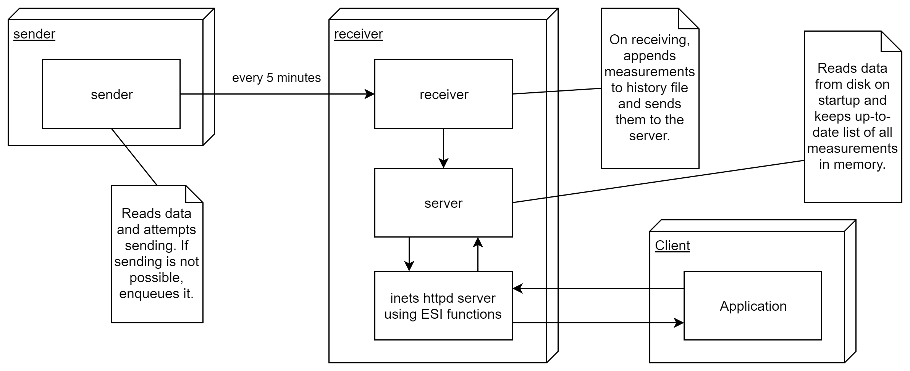

# WeatherPi
A simple weather station with the AM2302 temperature and humidity sensor, the
Raspberry Pi and an Android app.

## Description
Some of the code is very specific to the particular use case it was written
for, but other parts can work independently and may be useful for other
projects.

The physical setup consists of two Raspberry Pi computers:
* The sender is positioned in a relatively sheltered location outdoors and has
the sensor connected to its GPIO pins
* The receiver, which is the base station and also acts as the server for the
Android app

The receiver can be located anywhere, as long as it's also connected to the
local area network. In the situation this was developed for, this connection is
only established via WiFi, which may not be turned on all the time. Therefore,
a significant portion of the code is dedicated to gracefully handling this
case.

How the different components of the system work together can be visualized
like this:


The sender runs one process, which measures temperature and humidity every 5
minutes and sends the data to the receiver. It expects an acknowledgement and
if it doesn't receive it because the network broke, it will keep the
measurements in a queue, to be sent again when the network is available.

The receiver runs three processes. One of them is the inets httpd server that
is contacted by the Android app to receive measurements. When receiving a
request, its ESI functions message the server process to get the requested
data. This process has the responsibility of holding an up-to-date collection
of measurements at all times. As such, it reads previous measurements from file
on startup and receives new measurements from the receiver process. This final
process is messaged new measurements by the sender, writes them to file and
sends them to the server.

## Installation
First, you need to install a Python module by Adafruit that allows easy reading
of values from the AM2302 sensor on the sender.
```
# Make sure you have all build tools
sudo apt-get install build-essential python-dev
# Get code
git clone https://github.com/adafruit/Adafruit_Python_DHT.git
cd Adafruit_Python_DHT
# Install module
sudo python setup.py install
# Run a test (with sensor connected to GPIO data pin 4)
python examples/AdafruitDHT.py 2302 4
# Delete no longer needed code
cd ..
sudo rm -r Adafruit_Python_DHT
```

After that, install Erlang on both machines if you don't have it already.
On a headless Pi, you might be interested in only installing the basics,
without any GUI bloat.
```
sudo apt-get install erlang-base
```

Provided you also have the code of this project on both machines, you're good
to go now.

## Usage
On both the sender and receiver, inside the `WeatherPi/pi/` directory, run
`make` to compile the Erlang code.

On the sender, run
```
erl -name sender@IPSENDER -setcookie 'weatherstation' -noshell
```
to start the Erlang node where the sender process will be spawned.

On the receiver, run
```
erl -name receiver@IPRECEIVER -setcookie 'weatherstation' -noshell -eval \
"weather:start('sender@IPSENDER', \"4\")."
```
to start the Erlang node for the receiver processes and begin execution.

Remember to replace the placeholders with the internal IP addresses of the two
machines. You might want to start the nodes inside a terminal multiplexer to
keep them running in the background even if you close your session.

## License
[MIT License](LICENSE)

## Libraries
This project was built with the following libraries, whose licenses can be
found in [LICENSE-3RD-PARTY](LICENSE-3RD-PARTY).
* [Android Async Http Client](http://loopj.com/android-async-http/)
* [MPAndroidChart](https://github.com/PhilJay/MPAndroidChart)
* [Android Support Library](  
https://developer.android.com/topic/libraries/support-library/index.html)
